  

 

 

## Cómo trabajo

Vengo del diseño y terminé en el código, así que no entrego mockups que nadie puede
construir ni interfaces que nadie quiere usar. Diseño y programo la misma pieza.

- **El entregable es algo desplegado.** Figma es el medio, no el resultado.
- **Sistemas antes que pantallas.** Un radio, dos curvas de easing, cuatro duraciones. Si una decisión aparece dos veces, se vuelve token.
- **Herramientas propias.** Si algo me estorba dos veces, lo automatizo. De ahí salieron `vanzi`, mis dotfiles y mi config de Neovim.

 

## Stack

 

## En qué ando

| Proyecto | Qué es | Stack |
| :--- | :--- | :--- |
| **[vanzi](https://github.com/tarquibrian/vanzi)** ⭐ 8 | Mi entorno de desarrollo empaquetado y reproducible | `Shell` |
| **[devanzire.nvim](https://github.com/tarquibrian/devanzire.nvim)** | Mi configuración de Neovim, convertida en plugin instalable | `Lua` |
| **[tmux-vanzi-hub](https://github.com/tarquibrian/tmux-vanzi-hub)** | Hub de sesiones y plugins para tmux | `JavaScript` |
| **[facturabot](https://github.com/tarquibrian/facturabot)** | Facturación fiscal boliviana conversacional por WhatsApp | `TypeScript` |
| **[puriq-agent](https://github.com/tarquibrian/puriq-agent)** | Agente sobre modelos de lenguaje | `Python` |
| **[terbol-webapp](https://terbol-webapp.vercel.app)** | Webapp en producción | `TypeScript` |

 

## Métricas

 

## Contribuciones

  

 

  ¿Construimos algo? — <a href="mailto:tarquiman@gmail.com">tarquiman@gmail.com</a>

